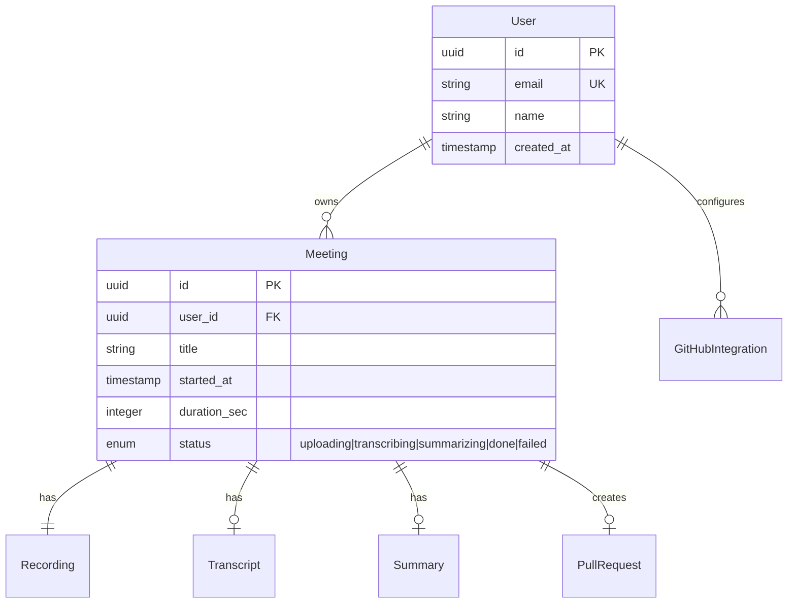

# Data Modeler (Stage 3)

시나리오(`01-scenarios.md`)와 와이어프레임(`02-wireframes.md`)을 입력으로 받아 데이터 모델을 설계.

## When to invoke

**Trigger on:**
- "데이터 구조 / 스키마 / 엔티티 / ERD / 데이터 모델"
- `/data-model`
- 와이어프레임 완료 후 자연스럽게 이어지는 단계

**Do NOT trigger on:**
- 실제 마이그레이션 SQL 생성 (구현 단계)
- ORM 코드 작성 (구현 단계)

## 핵심 원칙

1. **시나리오·와이어프레임이 입력** — 둘 중 하나라도 없으면 사용자에게 안내
2. **엔티티는 사용자가 본 것에서 도출** — 와이어프레임에 안 나오는 것은 만들지 않음 (`🔸 [추정]`은 가능)
3. **타입은 추상적으로 먼저** — `string`, `text`, `integer`, `timestamp`, `enum<a|b|c>` 같은 수준. DB-specific 타입(VARCHAR(255) 등)은 구현 단계에서.
4. **관계 명시** — 1:1, 1:N, N:N + 외래키 방향
5. **인덱스/제약 단서만** — "이 필드는 unique", "이 필드로 자주 조회됨" 같은 힌트
6. **추정·미정 마킹** — 사용자가 명시 안 한 필드는 `🔸 [추정]`

## Workflow

### Step 0: 입력 파일 확인

```
docs/planning/<slug>/01-scenarios.md
docs/planning/<slug>/02-wireframes.md
```

둘 다 읽어서 다음 도출:
- 시나리오의 "핵심 데이터(스케치)" 섹션
- 와이어프레임의 각 화면에 표시되는 데이터
- 각 화면의 폼 입력 필드

### Step 1: 엔티티 목록 도출 + 확인

```
도출된 엔티티 후보:
1. User (회원, 인증, 권한)
2. Meeting (회의 메타데이터)
3. Recording (오디오 파일, 처리 상태)
4. Transcript (STT 결과)
5. Summary (Claude 요약 결과)
6. GitHubIntegration (리포 연결, 설치 토큰)
🔸 [추정] 7. Notification (알림 발송 기록)

이 목록 맞나요? 추가/제거할 엔티티 있나요?
```

### Step 2: ER 다이어그램 (Mermaid)

엔티티 간 관계를 `erDiagram`으로:



사용자 확인:
> "관계 OK? 누락된 관계나 잘못된 화살표 있나요?"

### Step 3: 엔티티별 상세 정의

각 엔티티마다:

```markdown
### Entity: Meeting

회의 1건의 메타데이터와 처리 상태를 보관.

| Field | Type | Nullable | Default | Notes |
|-------|------|----------|---------|-------|
| id | uuid | No | gen_random_uuid() | PK |
| user_id | uuid | No | — | FK → User.id |
| title | string | No | — | 사용자 입력 또는 "제목 없는 회의" |
| started_at | timestamp | No | now() | |
| duration_sec | integer | Yes | null | 녹음 완료 시 채워짐 |
| status | enum | No | "uploading" | uploading\|transcribing\|summarizing\|creating_pr\|done\|failed |
| attendees | string[] | Yes | [] | 쉼표 입력을 분리해 저장 |
| pr_url | string | Yes | null | done 상태가 되면 채워짐 |
| pr_number | integer | Yes | null | |
| error_message | text | Yes | null | failed일 때만 |
| created_at | timestamp | No | now() | |
| updated_at | timestamp | No | now() | |

**Indexes / Constraints**:
- `(user_id, started_at DESC)` — 대시보드 목록 조회용
- 🔸 [추정] `status` 인덱스 — 처리중 회의 필터링

**파생/계산 필드**:
- `is_processing` = status NOT IN ('done', 'failed')

**라이프사이클**:
1. 녹음 시작 시 생성 (status='uploading')
2. 업로드 완료 시 → transcribing
3. STT 완료 시 → summarizing
4. 요약 완료 시 → creating_pr
5. PR 생성 시 → done (또는 어디서든 failed)
```

엔티티 작성 후 사용자 확인.

### Step 4: 시나리오 단계와 데이터 변화 매핑

시나리오의 각 step에서 어떤 엔티티가 만들어지거나 바뀌는지:

| 시나리오 Step | 엔티티 변화 |
|---------------|------------|
| Step 1.1 회원가입 | User INSERT |
| Step 1.4 녹음 시작 | Meeting INSERT (status=uploading) |
| Step 1.5 녹음 종료 | Meeting UPDATE (status=transcribing), Recording INSERT |
| Step 1.6 STT 완료 | Transcript INSERT, Meeting UPDATE (status=summarizing) |
| Step 1.7 요약 완료 | Summary INSERT, Meeting UPDATE (status=creating_pr) |
| Step 1.8 PR 생성 | Meeting UPDATE (status=done, pr_url=...) |

이 표가 인터랙션 다이어그램(Stage 4) 작성의 핵심 입력.

### Step 5: 파일 저장 + 다음 단계 안내

`docs/planning/<slug>/03-data-model.md`로 저장. 구조:

```markdown
# 데이터 모델 — <제품/기능명>

## 메타
- 작성일: YYYY-MM-DD
- 입력: 01-scenarios.md, 02-wireframes.md

## 1. 엔티티 목록

## 2. ER 다이어그램 (Mermaid)

## 3. 엔티티별 상세

### 3.1 User
### 3.2 Meeting
...

## 4. 시나리오 ↔ 데이터 변화 매핑

## 5. Open Questions
```

완료 후:
> "데이터 모델 완료. 다음은 인터랙션 다이어그램 단계입니다. `/interactions` 또는 `interaction-designer` 스킬로 이어갈 수 있습니다."

## 안 좋은 패턴

- ❌ 와이어프레임에 안 나온 엔티티/필드를 멋대로 추가
- ❌ DB-specific 타입(VARCHAR, NVARCHAR, BIGINT 등) 사용 — 추상 타입으로
- ❌ 인덱스 결정 환각 — 명확한 근거(자주 조회됨, unique 제약 등) 없이 인덱스 박지 말 것
- ❌ 시나리오 ↔ 데이터 변화 매핑 누락 — 이게 Stage 4 입력의 핵심
