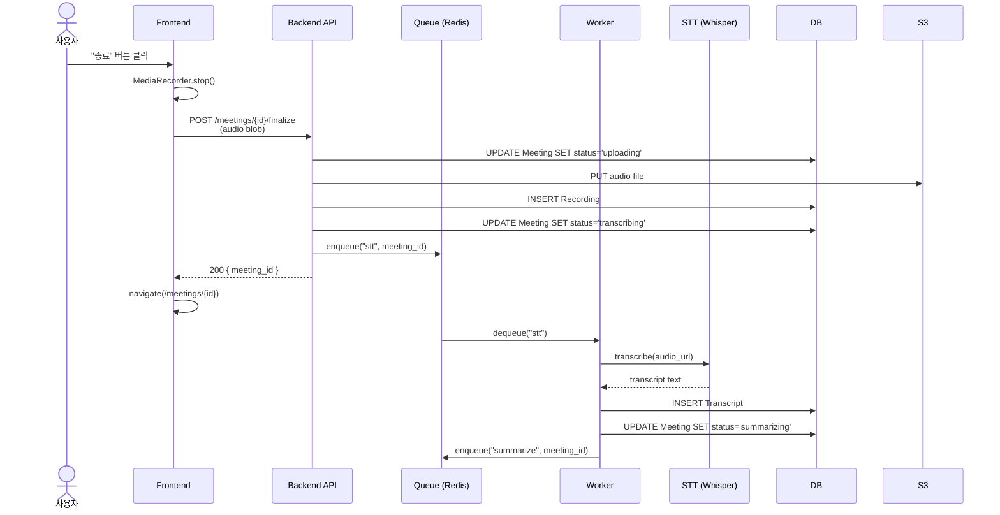
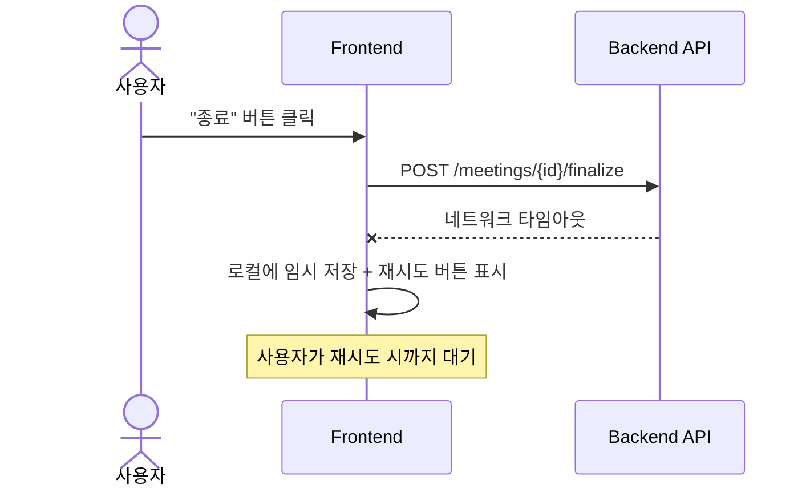
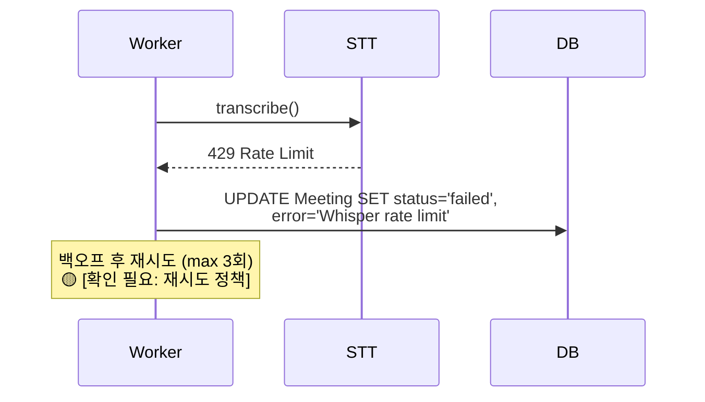

# Interaction Designer (Stage 4)

와이어프레임(`02-wireframes.md`)의 "인터랙션 포인트"와 데이터 모델(`03-data-model.md`)을 입력으로, 각 UI 이벤트의 시스템 흐름을 시퀀스 다이어그램으로 작성.

## When to invoke

**Trigger on:**
- "인터랙션 / 이벤트 흐름 / 시퀀스 / 다이어그램 만들어줘"
- `/interactions`
- 데이터 모델 완료 후 자연스럽게 이어지는 단계

**Do NOT trigger on:**
- 코드 구현 요청
- 시스템 아키텍처 다이어그램(별개)

## 핵심 원칙

1. **와이어프레임의 인터랙션 포인트 표가 입력** — 빠짐없이 매핑
2. **각 이벤트마다 별도 시퀀스 다이어그램** — 한 다이어그램에 다 우겨넣지 말 것
3. **Actor → Frontend → Backend → External → DB 레인 분리**
4. **성공 경로 + 실패 경로 둘 다** — happy path만 그리면 미완성
5. **데이터 변화 명시** — Stage 3의 "시나리오 ↔ 데이터 변화 매핑"과 일치
6. **추정·미정 마킹** — 사용자 결정 없는 분기는 `🟡 [확인 필요]`

## Workflow

### Step 0: 입력 파일 확인

```
docs/planning/<slug>/01-scenarios.md
docs/planning/<slug>/02-wireframes.md
docs/planning/<slug>/03-data-model.md
```

세 파일에서 추출:
- 인터랙션 포인트 표 (02 Step 4)
- 시나리오 ↔ 데이터 변화 매핑 (03 Step 4)
- 분기 시나리오 (01의 분기 섹션)

### Step 1: 이벤트 목록 + 우선순위 확정

```
와이어프레임에서 추출된 이벤트:
1. 로그인 제출 (btn-login-submit)
2. 회의 카드 클릭 (card-meeting-N)
3. 녹음 시작 (btn-record-start)
4. 녹음 종료 (btn-record-stop)
5. PR 링크 클릭 (link-pr)
6. 설정 저장 (btn-settings-save)
🔸 [추정] 7. 재시도 클릭 (btn-retry)

이 중 다이어그램 그릴 우선순위는?
- 모두: 충실하지만 시간 걸림
- 핵심 5개: 1~5번
- 사용자 지정
```

### Step 2: 각 이벤트별 시퀀스 다이어그램 (Mermaid)

각 이벤트마다 다음 패턴으로:

````markdown
### 이벤트: 녹음 종료 (btn-record-stop)

**트리거**: 녹음 페이지에서 사용자가 "종료" 버튼 클릭
**선행 상태**: Meeting (status=uploading), MediaRecorder running
**기대 결과**: Meeting status=transcribing, 회의 상세 페이지로 이동, STT 시작

#### 성공 경로



#### 실패 경로 1: 업로드 실패 (네트워크 오류)



#### 실패 경로 2: STT 실패 (Whisper 한도 초과)



#### Acceptance criteria
- [ ] 종료 클릭 후 500ms 이내 회의 상세로 이동
- [ ] 네트워크 실패 시 로컬에 오디오 보존
- [ ] STT 실패 시 재시도 가능한 상태로 남음

#### 관련 데이터 변화
- Meeting: status=uploading → transcribing → summarizing → done|failed
- Recording: INSERT 후 변화 없음
- Transcript: STT 성공 시 INSERT
````

각 이벤트 작성 후 사용자 확인:
> "이 흐름 OK? 빠진 분기 또는 잘못된 단계 있나요?"

### Step 3: 이벤트 → 엔티티 변화 일관성 점검

Step 2에서 그린 다이어그램이 Stage 3의 "시나리오 ↔ 데이터 변화" 표와 일치하는지 점검. 불일치하면 데이터 모델로 돌아가서 수정 제안.

### Step 4: 횡단 관심사 별도 정리

다음 항목은 다이어그램에 일일이 안 그리고 별도 섹션에:
- **인증**: 모든 API 요청에 인증 토큰 포함 (🟡 [확인 필요: 토큰 방식])
- **에러 핸들링 공통 패턴**: 4xx/5xx 응답 시 토스트, 5xx는 Sentry 로그
- **로딩 UI**: 모든 API 호출 중 스피너/스켈레톤
- **분석/이벤트 트래킹**: 🟡 [확인 필요: 어떤 이벤트를 트래킹?]

### Step 5: 파일 저장 + 다음 단계 안내

`docs/planning/<slug>/04-interactions.md`로 저장. 구조:

```markdown
# 인터랙션 다이어그램 — <제품/기능명>

## 메타
- 작성일: YYYY-MM-DD
- 입력: 01-scenarios.md, 02-wireframes.md, 03-data-model.md

## 1. 이벤트 목록

## 2. 이벤트별 시퀀스 다이어그램

### 2.1 로그인 제출
### 2.2 ...

## 3. 횡단 관심사

## 4. 일관성 점검 결과

## 5. Open Questions
```

완료 후:
> "인터랙션 다이어그램 완료. 다음은 최종 PRD 단계입니다. `/prd` 또는 `prd-writer` 스킬로 모든 산출물을 종합한 PRD를 작성할 수 있습니다."

## 안 좋은 패턴

- ❌ 한 다이어그램에 5개 이벤트 우겨넣기 — 이벤트당 1개
- ❌ Happy path만 그리고 실패 경로 누락
- ❌ 시퀀스에 컴포넌트만 적고 메시지 내용(payload, 상태값) 생략
- ❌ Stage 3와 불일치하는 데이터 변화 (점검 누락)
- ❌ 모든 이벤트를 동일한 깊이로 — 핵심 이벤트는 깊게, 단순 이벤트는 짧게
