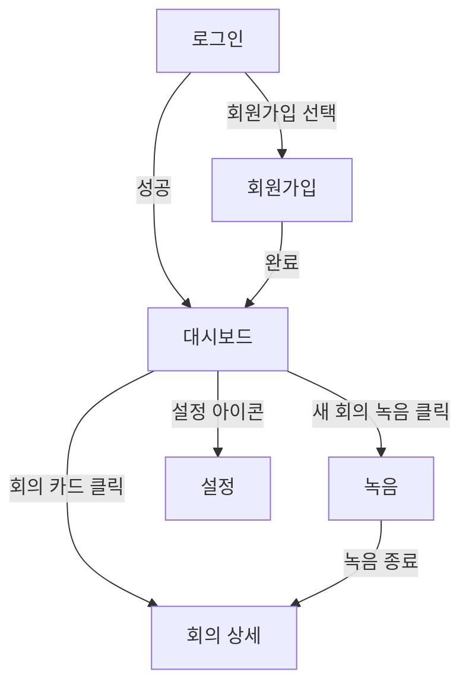

# Wireframe Designer (Stage 2)

시나리오(`01-scenarios.md`)를 입력으로 받아 사이트맵과 화면별 와이어프레임을 만드는 단계.

## When to invoke

**Trigger on:**
- "와이어프레임 / 화면 설계 / 사이트맵 / UI 구조 만들어줘"
- `/wireframe`
- 시나리오 작성 완료 후 자연스럽게 이어지는 단계

**Do NOT trigger on:**
- 실제 픽셀 디자인 요청 (Figma 작업)
- 기존 와이어프레임의 단순 수정 요청

## 핵심 원칙

1. **시나리오가 입력** — `01-scenarios.md` 없이는 진행하지 않음. 없으면 사용자에게 시나리오부터 작성하자고 안내.
2. **시나리오의 모든 step에 화면이 매핑돼야** — 누락된 화면 없는지 점검
3. **Mermaid는 사이트맵용** — 화면 간 이동 경로
4. **ASCII 박스 + 구조적 기술은 화면 내부용** — 영역, 요소, 상태, 카피
5. **상태 명시** — 빈 상태, 로딩, 에러, 성공 등 모든 상태 별도 표기
6. **추정 마킹** — 시나리오에 없던 UI 결정은 `🔸 [추정]`

## Workflow

### Step 0: 시나리오 파일 확인

```
docs/planning/<slug>/01-scenarios.md
```

읽고 다음을 추출:
- 등장 페르소나
- 모든 Step의 "관련 화면" 항목
- 분기 시나리오에서 추가로 필요한 화면

시나리오 파일이 없으면:
> "시나리오 단계가 먼저입니다. `/scenario` 또는 `scenario-writer` 스킬로 진행해주세요."

### Step 1: 화면 목록 도출 + 확인

시나리오에서 추출한 화면 목록을 사용자에게 보여주고 확인:

```
시나리오에서 도출된 화면 목록:
1. 로그인 / 회원가입
2. 대시보드
3. 새 회의 녹음
4. 회의 상세
5. 설정
🔸 [추정] 6. 에러 페이지 (네트워크 오류 시)

빠진 화면이 있나요? 추가/제거할 게 있으면 알려주세요.
```

### Step 2: 사이트맵 (Mermaid flowchart)

화면 간 이동을 Mermaid `graph TD`로:



사용자에게 확인:
> "이 사이트맵 흐름이 맞나요? 누락된 이동/잘못된 화살표가 있나요?"

### Step 3: 화면별 와이어프레임 (한 화면씩)

각 화면마다 다음 4파트로:

```markdown
### 화면: <이름>

**경로**: `/path`
**시나리오 매핑**: Step 1.3 (회원가입), Step 1.4 (첫 로그인)
**목적**: <한 줄로 — 이 화면에서 사용자가 무엇을 한다>

**Layout (ASCII)**:
```
┌─────────────────────────────────────────┐
│ [Header — 로고]              [메뉴]     │
├─────────────────────────────────────────┤
│                                         │
│  ┌────────────────────────────────────┐ │
│  │  Hero Section                      │ │
│  │  - 제목                            │ │
│  │  - 부제                            │ │
│  │  [CTA 버튼]                        │ │
│  └────────────────────────────────────┘ │
│                                         │
│  ┌──────┐  ┌──────┐  ┌──────┐          │
│  │ Card │  │ Card │  │ Card │          │
│  └──────┘  └──────┘  └──────┘          │
│                                         │
└─────────────────────────────────────────┘
```

**Regions**:
- Header (고정 상단): 로고, 메뉴
- Hero: 페이지 목적 안내 + 핵심 CTA
- Content Cards: 데이터 카드 그리드

**Elements**:
| ID | 종류 | 설명 | 동작 |
|----|------|------|------|
| btn-cta-primary | Button | "시작하기" | → /signup |
| card-item-N | Card | 회의 카드 | → /meetings/:id |

**States**:
- Empty: 카드 0개일 때 안내 + CTA
- Loading: 스켈레톤 카드 3개
- Error: "다시 시도" 버튼 포함 메시지
- Success: 카드 그리드 표시

**Copy (한국어 기본)**:
- 제목: "..."
- 부제: "..."
- CTA: "시작하기"
- Empty 상태: "..."

**모바일 변형**:
- 카드 그리드: 3열 → 1열
- 메뉴: 햄버거로 축소
```

각 화면 작성 후 사용자 확인:
> "이 화면 OK? 빠진 요소나 상태가 있나요?"

### Step 4: 핵심 인터랙션 포인트 표시

각 화면에서 이벤트가 발생하는 지점을 명시. 다음 단계(인터랙션 다이어그램)의 입력:

```markdown
## 인터랙션 포인트 (Stage 4 입력)

| 화면 | 이벤트 | 트리거 요소 | 결과 |
|------|--------|------------|------|
| 로그인 | 로그인 제출 | btn-login-submit | API 호출 → 대시보드 |
| 대시보드 | 카드 클릭 | card-meeting-N | 회의 상세로 이동 |
| 녹음 | 녹음 시작 | btn-record-start | MediaRecorder 시작 |
| 녹음 | 녹음 종료 | btn-record-stop | 업로드 → 처리 |
```

### Step 5: 파일 저장 + 다음 단계 안내

`docs/planning/<slug>/02-wireframes.md`로 저장. 구조:

```markdown
# 와이어프레임 — <제품/기능명>

## 메타
- 작성일: YYYY-MM-DD
- 입력 시나리오: 01-scenarios.md

## 1. 화면 목록

## 2. 사이트맵

(Mermaid)

## 3. 화면별 와이어프레임

### 3.1 ...
### 3.2 ...

## 4. 인터랙션 포인트 (Stage 4 입력)

## 5. Open Questions
```

완료 후:
> "와이어프레임 완료. 다음은 데이터 모델 단계입니다. `/data-model` 또는 `data-modeler` 스킬로 이어갈 수 있습니다."

## 안 좋은 패턴

- ❌ 시나리오 없이 와이어프레임 시작
- ❌ Empty/Loading/Error 상태 누락 (Happy state만 있는 와이어프레임은 미완성)
- ❌ ASCII 박스만 그리고 Regions/Elements/Copy 생략
- ❌ 모바일 변형 생략 (반응형이면 반드시)
- ❌ 사이트맵에 분기 시나리오 누락 (실패/취소 경로)
